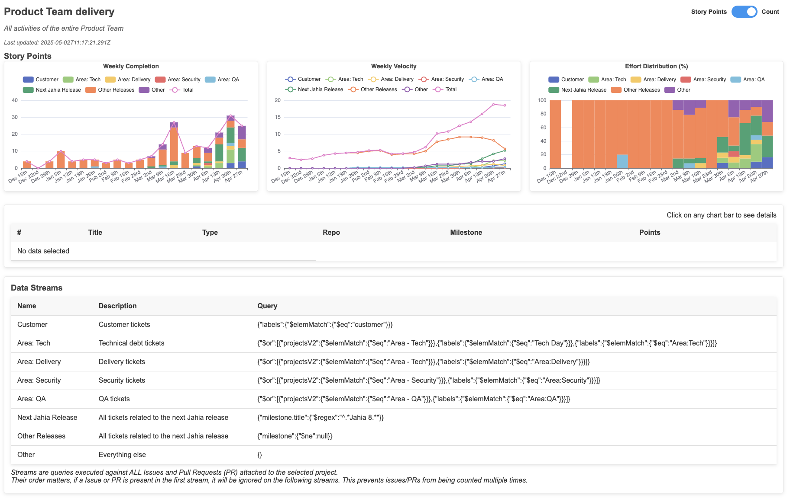
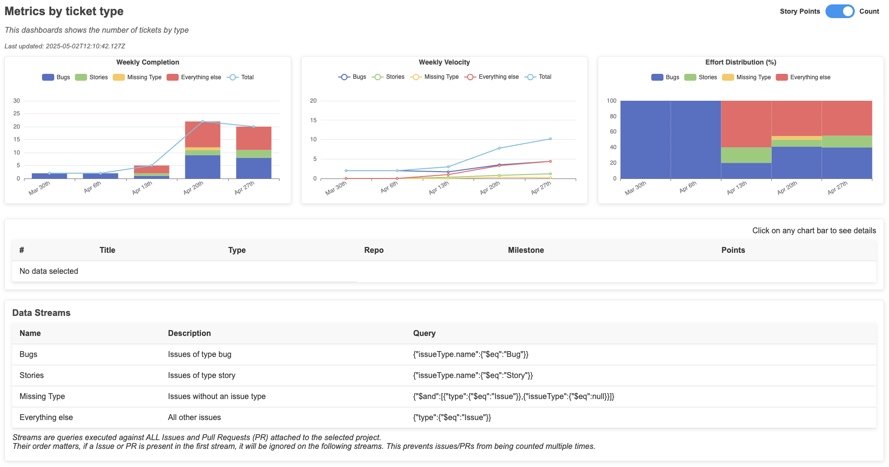
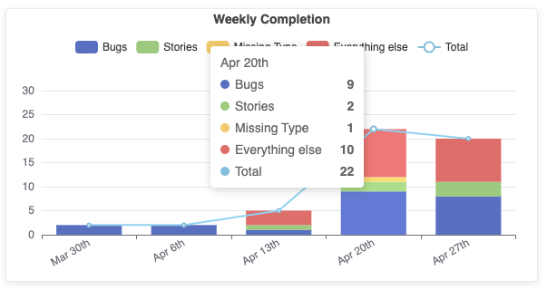
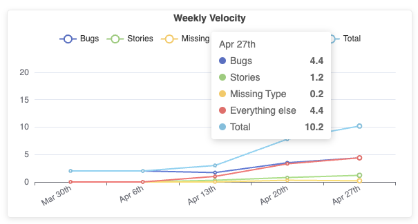
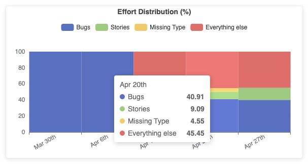

<!-- markdownlint-disable MD041 -->
<p align="center">
  
  <h2 align="center">Metrics for GitHub Projects</h2>
  <p align="center">A GitHub Action to generate metrics out of the content of GitHub Projects</p>
</p>

---

<div align="center">

[](https://github.com/super-linter/super-linter)

[](https://github.com/fgerthoffert/actions-project-activity/actions/workflows/check-dist.yml)
[](https://github.com/fgerthoffert/actions-project-activity/actions/workflows/codeql-analysis.yml)
[](./badges/coverage.svg)

</div>

---

# About

This action is directly inspired by the metrics and dashboard generation
approaches used in [ZenCrepes](https://github.com/zencrepes) and
[Jira Agile Velocity](https://github.com/Fgerthoffert/jira-agile-velocity) and
aims at providing detailed metrics about a single GitHub Project.

The data is then made available in self-contained HTML pages, with simple
user-friendly controls to interact with the views.

<p align="center">
  
</p>

# Features

- Displays results as node counts (Issues or PRs) or Story Points
- Fully self-contained and operates on the client-side, eliminating the need for
  server-side rendering.
- Switch between count-based or Story Points-based metrics.
- 3 Charts:
  - Weekly completion
  - Moving average (velocity) over configurable window (6 weeks by default)
  - Effort distribution
- A table view to link calculated metrics to actual data nodes (Issues or PRs)
- Stateless, all of the metrics are calculated from data in GitHub
- Multiple levels of filtering, allowing users to apply filters at both group
  and stream levels for more granular data selection
  ([doc](#group-level-filtering))
- Generate streams from of aggregations ([doc](#aggregations-buckets))

# Limitation

For the time being, this only works with non-archived items. This limitation is
due to the current lack of a GitHub API to retrieve archived cards in a project.

A discussion was
[opened on that topic](https://github.com/orgs/community/discussions/158440), in
the meantime you can filter out your project views using a filter such as
`updated:>@today-2w`.

If nothing progress on that front, a workaround is possible, but will be quite
If nothing progresses on that front, a workaround is possible, but it will
involve significantly more API calls and processing time, making it less
efficient to run. project).

# Overview

The action fetches all data from the configured GitHub project and will collect
data about all closed Issues and Pull Requests in the project.

Using a provided configuration file, it can generate multiple dashboards over
the same data with each of these dashboards supporting multiple data streams.

But first, some details about terminology:

- A **node** refers indifferently to a GitHub Issue or a GitHub PullRequest
  attached to a project.
- A **group** is composed of one or more streams. For each group, an HTML
  dashboard is generated. Groups are unrelated to each other.
- A **stream** represents a set of similar issues from which you'd like to
  collect some metrics. It uses a MongoDB **query** is a MongoDB query (using
  [Mingo](https://www.npmjs.com/package/mingo)). Streams are executed in
  sequence, if a node is found in a stream, it is automatically removed from the
  following streams.

## Example: Breakdown by issue type

You're insterested by a breakdown of effort by issue type. In particular you'd
like to get a sense of the ratio for stories vs. bugs. You'd also interested to
see other type of issues as well as issues that might be missing a type.

The configuration file would look like this:

```yaml
fields:
  points: Story Points
movingWindow: 6 # in weeks, window to calculate moving average
groups:
  - name: Metrics by ticket type
    description: This dashboards shows the number of tickets by type
    defaultMetric: nodes
    streams:
      - name: Bugs
        description: 'Issues of type bug'
        query: { issueType.name: { $eq: 'Bug' } }
      - name: Stories
        description: 'Issues of type story'
        query: { issueType.name: { $eq: 'Story' } }
      - name: Missing Type
        description: 'Issues without an issue type'
        query:
          { $and: [{ type: { $eq: 'Issue' } }, { issueType: { $eq: null } }] }
      - name: Everything else
        description: 'All other issues'
        query: { type: { $eq: 'Issue' } }
```

Some notable elements of the configuration:

- To detect issues with missing types, we need to exclude PullRequests since
  these do not have Issue types, this is done by querying only for Issues AND
  **null** issueType:
  - query:
    `{ $and: [{ type: { $eq: 'Issue' } }, { issueType: { $eq: null } }] }`.
- For all other issues, we need to make sure we're excluding Pull Requests:
  - query: `{ type: { $eq: 'Issue' } }`.
- You can choose between using nodes counts (value: `nodes`) or Story Points
  (value: `points`) as the default view for the generated dashboards. This
  default to points.

### HTML Dashboard

<p align="center">
  
</p>

You will notice at the bottom left a switch to alternate between calculating
metrics using Story Points or node count. Clicking on this automatically switch
between modes.

At the bottom of each chart, the date corresponds to the first day of the week
(using date-fns [startOfWeek()](https://date-fns.org/v4.1.0/docs/startOfWeek)).

#### Charts

<table>
  <tr>
    <td align="center">
      
    </td>
    <td>
      <b>Weekly Completion</b> <br />
      This chart shows nodes closed each week, expressed either in Story points or
      Issue Count (depending on the switch position).
      <br /><br />
      The stacked bars represent the
      various streams (see configuration above) while the line represents the total.
      <br /><br />
      For example, during the week of April 20th, a total of 22 issues were closed.
    </td>
  </tr>
  <tr>
    <td>
      <b>Weekly Velocity</b> <br />
      This chart displays the rolling average over the configured window (6 weeks by default)
      <br /><br />
      For example, in this screenshot, on average, the team was completing 4.4 bugs each week over the past 6 weeks.
    </td>
    <td align="center">
      
    </td>
  </tr>
  <tr>
    <td align="center">
      
    </td>
    <td>
      <b>Effort distribution</b> <br />
      This chart shows the distribution of nodes per stream.
      <br /><br />
      For example, during the week of April 20th, 41% of the completed issues were bugs.
    </td>
  </tr>  
</table>

#### Table

Clicking on the chart opens the table view corresponding to the nodes used to
calculate the metrics (for that stream and that week).

<p align="center">
  
</p>

Finally, at the bottom of the dashboard, a table is used to display the
different data streams and their queries.

# Configuration

Dashboard generation is entirely configuration driven, you'll find below a
commented configuration file

```yaml
fields:
  points: Story Points # Name of the Project field used for Story Points
movingWindow: 6 # in weeks, window to calculate moving average
# Array of Groups, each group generate one HTML Dashboard
groups:
  # Name of the group, will be displayed at the top of the HTML dashboard
  - name: My First Group
    # Description displayed below the title in the HTML dashboard
    description: This dashboards shows the number of tickets by type
    # An optional category, used to regroup groups in the Dashboard index.
    category: My Category
    # An array of streams
    streams:
      # Name of the stream
      - name: Stream Name
        # Description of the stream
        description: 'Issues of type bug'
        # MongoDB Query
        query: { issueType.name: { $eq: 'Bug' } }
```

## Advanced Configuration

### Initiatives

It is sometimes interesting to measure how a team is able to maintain its focus
while working on a particular initiative.

In this context, an initiative (or Epic, or tree of children) is a GitHub Issue
having children. The action will recursively retrieve all children of a GitHub
Issue. It will then attach an "initiative" object to all of the children issues.

Here is a sample configuration for initiative:

```yaml
fields:
  points: Story Points
  # Moving rolling average window in weeks
movingWindow: 6
initiatives:
  - name: 'My Initiative'
    repository: MyOrg/MyRepo
    issueNumber: 63
  - name: 'Another Initiative'
    repository: MyOrg/MyOtherRepo
    issueNumber: 123
```

The initiative attached to the issue will match the following type or be `null`
if none were found:

```typescript
interface DeliveryInitiative {
  id: string // The GitHub Issue ID of the initiative issue
  name: string // The name of the initiative from the configuration
  title: string // The GitHub Issue title of the initiative
  url: string // The GitHub Issue URL of the initiative
}
```

You can then simply filter issues with queries, here's a sample configuration
for a group.

```yaml
fields:
  points: Story Points
movingWindow: 6
initiatives:
  - name: 'My Initiative'
    repository: MyOrg/MyRepo
    issueNumber: 63
groups:
  - name: My Team focus
    description:
      'Ratio of tickets associated to an initiative vs. all other tickets
      completed by the team'
    defaultMetric: nodes
    streams:
      - name: My Initiative
        description: 'Tickets associated with the team initiative'
        query:
          {
            $and:
              [
                { initiative.name: { $eq: 'My Initiative' } },
                { project.Team: { $eq: 'My Team' } }
              ]
          }
      - name: All other tickets
        description: 'All other tickets by the team'
        query: { project.Team: { $eq: 'My Team' } }
```

### Aggregations (buckets)

You might want to generate aggregations by a particular field. This can be done
by using the `groupByField` parameter, providing the corresponding field to
group by.

This parameter is not compatible with configuration-provided streams, but
instead streams will be generated from the result of the aggregations.

Here is a sample configuration with aggregation:

```yaml
fields:
  points: Story Points
movingWindow: 6
groups:
  - name: Delivery by team
    groupByField: project.Team
```

### Group-level filtering

You can filter out the dataset used to generate the streams. This is done by
providing an optional `query` parameter at the group level.

When provided, all nodes collected from the project, will go through one first
level of filtering, before the individual streams are generated.

Here is a sample with group-level filtering, this will only use issues closed
after March 1st, 2025.

```yaml
fields:
  points: Story Points
movingWindow: 6
groups:
  - name: Customer tickets vs. other
    query: { closedAt: { $gte: '2025-03-01T00:00:00Z' } }
    streams:
      - name: Customer
        description: Customer tickets
        query: { labels: { $elemMatch: { $eq: 'customer' } } }
      - name: all tickets
        description: All other tickets
        query: {}
```

Note that you could also have achieved the same result by adding the date
restriction to each individual stream.

### Stream templates

To simplify the configuration and avoid duplicate content, you can define
streams as a template and use them in a configuration group.

```yaml
fields:
  points: Story Points
movingWindow: 6
groups:
  - name: Team A
    description: Customer tickets for Team A
    query: { project.Team: { $eq: 'Team A' } }
    streamsTemplate: teams
  - name: Team B
    description: Customer tickets for Team B
    query: { project.Team: { $eq: 'Team B' } }
    streamsTemplate: teams
templates:
  - name: teams
    description: Streams common across multiple teams
    streams:
      - name: Customer
        description: Customer tickets
        query: { labels: { $elemMatch: { $eq: 'customer' } } }
      - name: Other
        description: Everything else
        query: {}
```

### Relative dates

You can use relative dates in your Mingo queries. This is not directly supported
by Mingo/MongoDB, but when loading the configuration, the action will
automatically replace the dates.

```yaml
...
    query:  { closedAt: { $gte: '@today-3m' } },
...
```

Will automatically be replaced by the current date - 3 months.

This supports days (d), weeks (w), months (m) and years (y), all from the
execution date of the action (today).

- @today-3m: 3 Months ago
- @today-2w: 2 Weeks ago
- ...

# Querying

Querying is done towards an in-memory array of nodes using
[Mingo](https://www.npmjs.com/package/mingo), which makes it possible to query
the array using a MongoDB syntax.

Understandably though, building the right query can be complex, and it is likely
that this document will not always be 100% up-to-date with likely evolutions of
the data model.

Nevertheless, the [TypeScript interfaces](./src/types/delivery.ts) for
`DeliveryItem` should remain up-to-date and contain relevant details to help you
build your queries.

## Querying playground

Understandably, queries can be complex to build without a playground to try them
out.

To help you out, you could being by creating a simple dashboard containing all
your issues.

```yaml
fields:
  points: Story Points
  # Moving rolling average window in weeks
movingWindow: 6
groups:
  - name: All streams
    description: Single-stream dashboard
    streams:
      - name: All
        description: All
        query: {}
```

Once the dashboard is generated, open it and open the developer tools.

In the Console, load Mingo:

```javascript
const script = document.createElement('script')
script.src = 'https://cdn.jsdelivr.net/npm/mingo@6.6.1/dist/mingo.min.js'
script.onload = () => console.log('Mingo loaded')
document.head.appendChild(script)
```

You should see a "Mingo loaded" message.

Then you can try queries like this:

```javascript
const { Query } = mingo

// Display all nodes
console.log(window.dataNodes)
const mingotest = new Query({ type: { $eq: 'Issue' } }).find(window.dataNodes)

// Filtered nodes
console.log(mingotest.all())
```

# Usage

You would typically trigger this action manually or run it on a cron/schedule to
generate periodic reports.

Its configuration would look like this:

```yaml
name: Generate project metrics

on:
  workflow_dispatch:

jobs:
  get-metrics:
    runs-on: ubuntu-latest
    steps:
      # Checkout need to retrieve the config file
      - uses: actions/checkout@v4
      - name: Generate project metrics
        # Replace main by the release of your choice
        uses: fgerthoffert/actions-project-activity@main
        with:
          token: YOUR_TOKEN
          config: '.github/project-activity.yml'
          github_org_name: YOUR_ORG
          github_project_number: 50
          views_output_path: './my-reports/'
      - uses: actions/upload-artifact@v4
        with:
          name: project-report
          path: './my-reports/'
```

# How to contribute

- Fork the repository
- npm install
- Rename .env.example into .env
- Update the INPUT\_ variables
- Do your changes
- npx local-action . src/main.ts .env
- npm run bundle
- npm test
- PR into this repository, detailing your changes

More details about GitHub TypeScript action are
[available here](https://github.com/actions/typescript-action)
