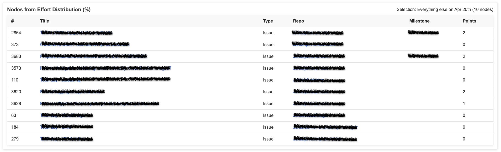

<!-- markdownlint-disable MD041 -->
<p align="center">
  
  <h2 align="center">Metrics for GitHub Projects</h2>
  <p align="center">A GitHub Action to generate metrics from the content of GitHub Projects</p>
</p>

---

<div align="center">

[](https://github.com/super-linter/super-linter)

[](https://github.com/fgerthoffert/actions-project-activity/actions/workflows/check-dist.yml)
[](https://github.com/fgerthoffert/actions-project-activity/actions/workflows/codeql-analysis.yml)
[](./badges/coverage.svg)

</div>

---

# About

This action is inspired by the metrics and dashboard generation approaches used
in [ZenCrepes](https://github.com/zencrepes) and
[Jira Agile Velocity](https://github.com/Fgerthoffert/jira-agile-velocity). It
aims to provide detailed metrics for a single GitHub Project.

The data is made available in self-contained HTML pages, with simple,
user-friendly controls to interact with the views.

<p align="center">
  
</p>

# Features

- Displays results as node counts (Issues or PRs) or Story Points
- Fully self-contained: generates HTML files that can be rendered locally or on
  any web server
- Switch between count-based or Story Points-based metrics
- Three charts:
  - Weekly completion
  - Moving average (velocity) over a configurable window (6 weeks by default)
  - Effort distribution
- Table view to link calculated metrics to actual data nodes (Issues or PRs)
- Stateless: all metrics are calculated from data in GitHub
- Multiple levels of filtering, allowing users to apply filters at both group
  and stream levels for more granular data selection
  ([doc](#group-level-filtering))
- Generate streams from aggregations ([doc](#aggregations-buckets))
- Supports issue hierarchy (parent/child) for processing initiatives

# Limitation

Currently, this only works with non-archived items. This limitation is due to
the lack of a GitHub API to retrieve archived cards in a project.

A
[discussion was opened on this topic](https://github.com/orgs/community/discussions/158440).
In the meantime, you can filter your project views using a filter such as
`updated:>@today-2w`.

If there is no progress on this front, a workaround is possible, but it will
involve significantly more API calls and processing time, making it less
efficient to run.

# Overview

The action fetches all data from the configured GitHub project and collects data
about all closed Issues and Pull Requests in the project.

Using a provided configuration file, it can generate multiple dashboards over
the same data, with each dashboard supporting multiple data streams.

Some terminology:

- A **node** refers to either a GitHub Issue or a GitHub Pull Request attached
  to a project.
- A **group** is composed of one or more streams. For each group, an HTML
  dashboard is generated. Groups are independent of each other.
- A **stream** represents a set of similar issues from which you'd like to
  collect metrics. It uses a MongoDB query (via
  [Mingo](https://www.npmjs.com/package/mingo)). Streams are executed in
  sequence; if a node is found in a stream, it is automatically removed from the
  following streams.

## Example: Breakdown by Issue Type

Suppose you're interested in a breakdown of effort by issue type, such as the
ratio of stories vs. bugs. You may also want to see other issue types and issues
missing a type.

The configuration file would look like this:

```yaml
fields:
  points: Story Points
movingWindow: 6 # in weeks, window to calculate moving average
groups:
  - name: Metrics by ticket type
    description: This dashboard shows the number of tickets by type
    defaultMetric: nodes
    streams:
      - name: Bugs
        description: 'Issues of type bug'
        query: { issueType.name: { $eq: 'Bug' } }
      - name: Stories
        description: 'Issues of type story'
        query: { issueType.name: { $eq: 'Story' } }
      - name: Missing Type
        description: 'Issues without an issue type'
        query:
          { $and: [{ type: { $eq: 'Issue' } }, { issueType: { $eq: null } }] }
      - name: Everything else
        description: 'All other issues'
        query: { type: { $eq: 'Issue' } }
```

Notable elements of the configuration:

- To detect issues with missing types, exclude Pull Requests (which do not have
  issue types) by querying only for Issues **and** a `null` issueType:
  - query:
    `{ $and: [{ type: { $eq: 'Issue' } }, { issueType: { $eq: null } }] }`
- For all other issues, ensure Pull Requests are excluded:
  - query: `{ type: { $eq: 'Issue' } }`
- You can choose between using node counts (`nodes`) or Story Points (`points`)
  as the default view for the generated dashboards. The default is points.

### HTML Dashboard

<p align="center">
  
</p>

At the bottom left, there is a switch to alternate between calculating metrics
using Story Points or node count. Clicking this automatically switches between
modes.

At the bottom of each chart, the date corresponds to the first day of the week
(using date-fns [startOfWeek()](https://date-fns.org/v4.1.0/docs/startOfWeek)).

#### Charts

<table>
  <tr>
    <td align="center">
      
    </td>
    <td>
      <b>Weekly Completion</b> <br />
      This chart shows nodes closed each week, expressed either in Story Points or Issue Count (depending on the switch position).
      <br /><br />
      The stacked bars represent the various streams (see configuration above), while the line represents the total.
      <br /><br />
      For example, during the week of April 20th, a total of 22 issues were closed.
    </td>
  </tr>
  <tr>
    <td>
      <b>Weekly Velocity</b> <br />
      This chart displays the rolling average over the configured window (6 weeks by default).
      <br /><br />
      For example, in this screenshot, on average, the team was completing 4.4 bugs each week over the past 6 weeks.
    </td>
    <td align="center">
      
    </td>
  </tr>
  <tr>
    <td align="center">
      
    </td>
    <td>
      <b>Effort Distribution</b> <br />
      This chart shows the distribution of nodes per stream.
      <br /><br />
      For example, during the week of April 20th, 41% of the completed issues were bugs.
    </td>
  </tr>  
</table>

#### Table

Clicking on the chart opens the table view corresponding to the nodes used to
calculate the metrics (for that stream and that week).

<p align="center">
  
</p>

At the bottom of the dashboard, a table displays the different data streams and
their queries.

# Configuration

Dashboard generation is entirely configuration-driven. Below is a commented
configuration file:

```yaml
fields:
  points: Story Points # Name of the Project field used for Story Points
movingWindow: 6 # in weeks, window to calculate moving average
# Array of Groups, each group generates one HTML Dashboard
groups:
  # Name of the group, displayed at the top of the HTML dashboard
  - name: My First Group
    # Description displayed below the title in the HTML dashboard
    description: This dashboard shows the number of tickets by type
    # An optional category, used to group dashboards in the index
    category: My Category
    # An array of streams
    streams:
      # Name of the stream
      - name: Stream Name
        # Description of the stream
        description: 'Issues of type bug'
        # MongoDB Query
        query: { issueType.name: { $eq: 'Bug' } }
```

## Advanced Configuration

### Initiatives

It can be useful to measure how a team maintains focus while working on a
particular initiative.

An initiative (or Epic, or tree of children) is a GitHub Issue with children.
The action will recursively retrieve all children of a GitHub Issue and attach
an "initiative" object to all child issues.

Sample configuration for initiatives:

```yaml
fields:
  points: Story Points
  # Moving rolling average window in weeks
movingWindow: 6
initiatives:
  - name: 'My Initiative'
    repository: MyOrg/MyRepo
    issueNumber: 63
  - name: 'Another Initiative'
    repository: MyOrg/MyOtherRepo
    issueNumber: 123
```

The initiative attached to the issue will match the following type or be `null`
if none were found:

```typescript
interface DeliveryInitiative {
  id: string // The GitHub Issue ID of the initiative issue
  name: string // The name of the initiative from the configuration
  title: string // The GitHub Issue title of the initiative
  url: string // The GitHub Issue URL of the initiative
}
```

You can then filter issues with queries. Here's a sample configuration for a
group:

```yaml
fields:
  points: Story Points
movingWindow: 6
initiatives:
  - name: 'My Initiative'
    repository: MyOrg/MyRepo
    issueNumber: 63
groups:
  - name: Team A Focus
    description:
      'Ratio of tickets associated with an initiative vs. all other tickets
      completed by the team'
    defaultMetric: nodes
    streams:
      - name: My Initiative
        description: 'Tickets associated with the team initiative'
        query:
          {
            $and:
              [
                { initiative.name: { $eq: 'My Initiative' } },
                { project.Team: { $eq: 'Team A' } }
              ]
          }
      - name: All other tickets
        description: 'All other tickets by the team'
        query: { project.Team: { $eq: 'Team A' } }
```

### Aggregations (Buckets)

You might want to generate aggregations by a particular field. This can be done
using the `groupByField` parameter, providing the corresponding field to group
by.

This parameter is not compatible with configuration-provided streams; instead,
streams will be generated from the result of the aggregations.

Sample configuration with aggregation:

```yaml
fields:
  points: Story Points
movingWindow: 6
groups:
  - name: Delivery by team
    groupByField: project.Team
```

### Group-level Filtering

You can filter the dataset used to generate the streams by providing an optional
`query` parameter at the group level.

When provided, all nodes collected from the project will go through this first
level of filtering before the individual streams are generated.

Sample with group-level filtering (only uses issues closed after March 1st,
2025):

```yaml
fields:
  points: Story Points
movingWindow: 6
groups:
  - name: Customer tickets vs. other
    query: { closedAt: { $gte: '2025-03-01T00:00:00Z' } }
    streams:
      - name: Customer
        description: Customer tickets
        query: { labels: { $elemMatch: { $eq: 'customer' } } }
      - name: All tickets
        description: All other tickets
        query: {}
```

You could also achieve the same result by adding the date restriction to each
individual stream.

### Stream Templates

To simplify configuration and avoid duplication, you can define streams as a
template and use them in a configuration group.

```yaml
fields:
  points: Story Points
movingWindow: 6
groups:
  - name: Team A
    description: Customer tickets for Team A
    query: { project.Team: { $eq: 'Team A' } }
    streamsTemplate: teams
  - name: Team B
    description: Customer tickets for Team B
    query: { project.Team: { $eq: 'Team B' } }
    streamsTemplate: teams
templates:
  - name: teams
    description: Streams common across multiple teams
    streams:
      - name: Customer
        description: Customer tickets
        query: { labels: { $elemMatch: { $eq: 'customer' } } }
      - name: Other
        description: Everything else
        query: {}
```

### Relative Dates

You can use relative dates in your Mingo queries. This is not directly supported
by Mingo/MongoDB, but when loading the configuration, the action will
automatically replace the dates.

```yaml
...
    query:  { closedAt: { $gte: '@today-3m' } },
...
```

This will automatically be replaced by the current date minus 3 months.

Supported units: days (d), weeks (w), months (m), and years (y), all relative to
the execution date of the action (today).

- @today-3m: 3 months ago
- @today-2w: 2 weeks ago
- ...

### Timeline / MTTR

This is a particularly advanced use case, unlikely to be directly usable in your
situation. This action has the ability to calculate the time an issue's project
field had a particular value or the time it took for that issue to transition
from one value to another one.

Concretely, it makes it possible to calculate an issue MTTR, time it took for an
issue to be closed from the time it was picked up.

The data can be groupped by a particular field, making it possible to compare
MTTR between ticket types, MTTR between different story point values, ...

<p align="center">
  
</p>

The data needed to build such charts is not available via GitHub GraphQL API (or
via any other GitHub APIs),
[more details here](https://github.com/orgs/community/discussions/49602).

Luckily this data is available via GitHub Webhook events, so if you are able to
build a listener that will collect these, and save them in a location reachable
by the action, then the necessary data can be fecthed and MTTR charts generated.

Today, this can be achieved via ZenCrepes tooling, in particular
[zqueue (a webhook handler)](https://github.com/zencrepes/zqueue) and
[zindexer](https://github.com/zencrepes/zindexer/tree/master)
[utils:github-project-cards command](https://github.com/zencrepes/zindexer/blob/master/src/commands/utils/github-project-cards.ts).
Note that this is sparsely documented.

#### Sample config

The following configuration will fetch data from baseUrl, and will generate one
dashboard tracking how long it took (in business days) for a ticket to move from
the "In Progress" Status to the "Done" Status.

```yaml
timeline:
  remote:
    baseUrl: https://MY_SERVER/MY_DATA/
    username: 'USERNAME'
    password: 'PASSWORD'
  enabled: true
  groups:
    - name: All tickets
      description: All tickets from In Progress to Done
      field: 'Status'
      valueFrom: 'In Progress'
      valueTo: 'Done'
      query: {}
```

This other config sample, track how long a ticket stays in the "In Progress"
column and breaks this results by issue type (Bugs, Stories, ...).

```yaml
timeline:
  remote:
    baseUrl: https://MY_SERVER/MY_DATA/
    username: 'USERNAME'
    password: 'PASSWORD'
  enabled: true
  groups:
    - name: Time spent in the In-Progress state
      description:
      Collect for each type of issue, the time spent in the In-Progress state.
      field: 'Status'
      valueFrom: 'In Progress'
      groupByField: issueType.name
      query: {}
```

#### Config options

| Option         | Type   | Description                                                                     |
| -------------- | ------ | ------------------------------------------------------------------------------- |
| `name`         | string | Name of the group/dashboard.                                                    |
| `description`  | string | Description of what this group measures.                                        |
| `field`        | string | The project field to track transitions for (e.g., `Status`).                    |
| `valueFrom`    | string | The value in the field to start measuring from (e.g., `In Progress`).           |
| `valueTo`      | string | _(Optional)_ The value in the field to stop measuring at (e.g., `Done`).        |
| `groupByField` | string | _(Optional)_ Field to group results by (e.g., `issueType.name`).                |
| `query`        | object | _(Optional)_ Mingo query to filter which issues/PRs are included in this group. |

**Notes:**

- If `valueTo` is omitted, the time spent in the `valueFrom` state is measured
  until the next transition.
- `groupByField` allows you to break down the results by a specific field (e.g.,
  issue type).
- `query` can be used to further filter the issues included in the calculation.

# Querying

Querying is performed on an in-memory array of nodes using
[Mingo](https://www.npmjs.com/package/mingo), which allows querying the array
using MongoDB syntax.

Building the right query can be complex, and this document may not always be
100% up-to-date with changes to the data model.

However, the [TypeScript interfaces](./src/types/delivery.ts) for `DeliveryItem`
should remain up-to-date and provide relevant details to help you build your
queries.

## Querying Playground

To help you build queries, you can create a simple dashboard containing all your
issues:

```yaml
fields:
  points: Story Points
  # Moving rolling average window in weeks
movingWindow: 6
groups:
  - name: All streams
    description: Single-stream dashboard
    streams:
      - name: All
        description: All
        query: {}
```

Once the dashboard is generated, open it and open the developer tools.

In the Console, load Mingo:

```javascript
const script = document.createElement('script')
script.src = 'https://cdn.jsdelivr.net/npm/mingo@6.6.1/dist/mingo.min.js'
script.onload = () => console.log('Mingo loaded')
document.head.appendChild(script)
```

You should see a "Mingo loaded" message.

Then you can try queries like this:

```javascript
const { Query } = mingo

// Display all nodes
console.log(window.dataNodes)
const mingotest = new Query({ type: { $eq: 'Issue' } }).find(window.dataNodes)

// Filtered nodes
console.log(mingotest.all())
```

# Usage

You would typically trigger this action manually or run it on a schedule to
generate periodic reports.

Example configuration:

```yaml
name: Generate project metrics

on:
  workflow_dispatch:

jobs:
  get-metrics:
    runs-on: ubuntu-latest
    steps:
      # Checkout needed to retrieve the config file
      - uses: actions/checkout@v4
      - name: Generate project metrics
        # Replace main with the release of your choice
        uses: fgerthoffert/actions-project-activity@main
        with:
          token: YOUR_TOKEN
          config: '.github/project-activity.yml'
          github_org_name: YOUR_ORG
          github_project_number: 50
          views_output_path: './my-reports/'
      - uses: actions/upload-artifact@v4
        with:
          name: project-report
          path: './my-reports/'
```

# How to Contribute

- Fork the repository
- Run `npm install`
- Rename `.env.example` to `.env`
- Update the `INPUT_` variables
- Make your changes
- Run `npx local-action . src/main.ts .env`
- Run `npm run bundle`
- Run `npm test`
- Submit a PR to this repository, detailing your changes

More details about GitHub TypeScript actions are
[available here](https://github.com/actions/typescript-action)
